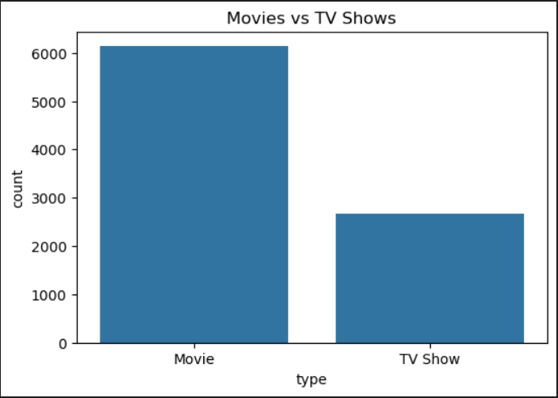

# 📊 Netflix Dataset Exploratory Data Analysis (EDA)

## 📌 Project Overview

This project focuses on Exploratory Data Analysis (EDA) of the Netflix Titles Dataset to identify trends, patterns, and business insights using Python and data visualization techniques.

The analysis includes data cleaning, preprocessing, statistical analysis, and visualization of Netflix content across different categories.

## 🎯 Objectives

* Understand dataset structure and quality
* Perform data cleaning and preprocessing
* Analyze content distribution
* Identify trends over years
* Generate business insights using visualizations

## 🛠️ Tools Used

* Python
* Pandas
* NumPy
* Matplotlib
* Seaborn
* Jupyter Notebook
* GitHub

## 📂 Project Structure

CodeAlpha_EDA_Project/

├── data/

│ └── netflix_titles.csv

├── notebooks/

│ └── eda_analysis.ipynb

├── images/

│ └── chart1.png

├── requirements.txt

└── README.md

## 📊 Analysis Performed

### Data Cleaning

* Checked missing values
* Removed duplicates
* Converted date columns
* Handled inconsistent values

### Exploratory Data Analysis

* Distribution of Movies vs TV Shows
* Country-wise content analysis
* Content ratings analysis
* Year-wise trend analysis
* Correlation analysis

## 📈 Key Insights

* Movies dominate Netflix content library.
* Significant growth in content addition after 2015.
* United States contributes the highest amount of content.
* TV-MA and TV-14 are the most common ratings.

## 📷 Sample Visualization

## 🚀 How to Run

Clone the repository:

git clone https://github.com/shruthi-7/CodeAlpha_EDA_Project.git

Install dependencies:

pip install -r requirements.txt

Run:

notebooks/eda_analysis.ipynb

## 👩‍💻 Author

Shruthi Merugu

CodeAlpha Data Analytics Internship
